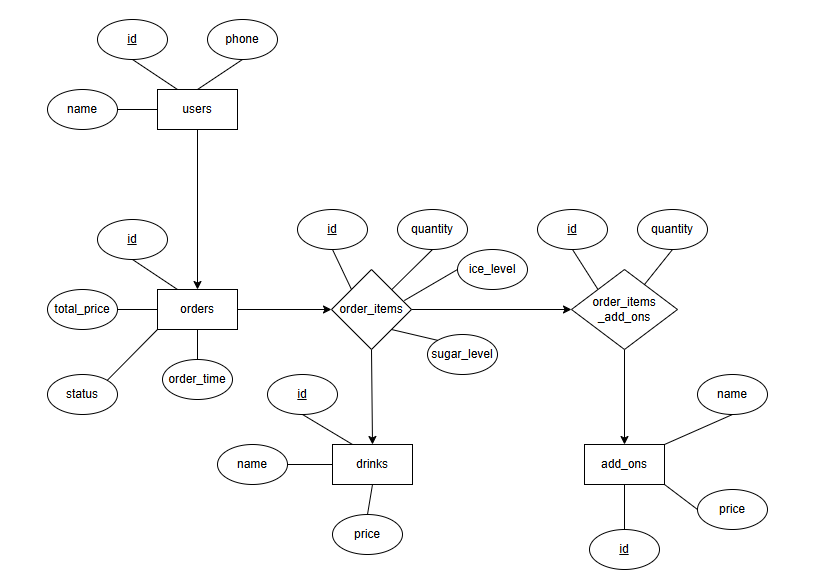
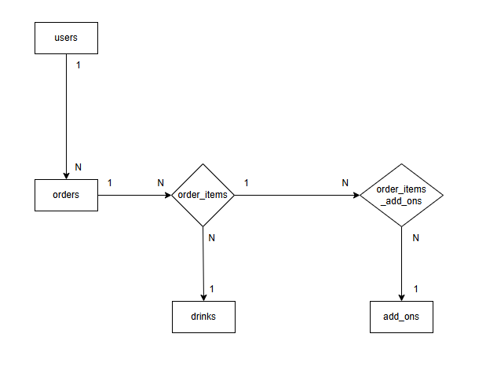
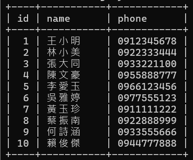
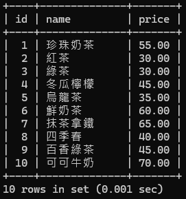
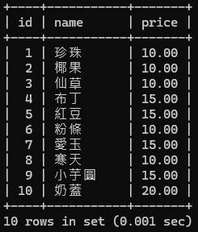
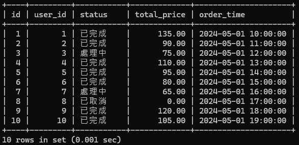
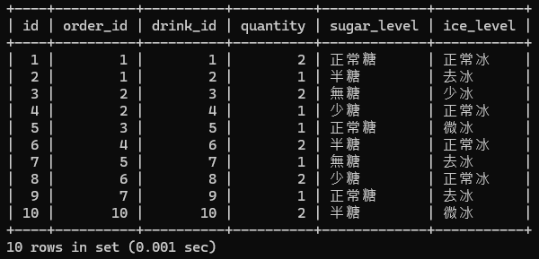
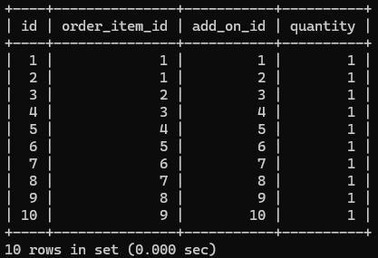
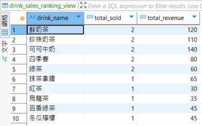
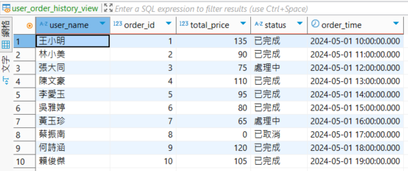

# 飲料點餐系統 (G05)

## 系統簡介
  本系統設計用於飲料店點餐流程的資料管理。使用者可透過前台介面下訂飲料，包含選擇品項、甜度、冰塊、數量與加料。系統會記錄訂單、計算總價，並可供後台查詢訂單歷史與銷售統計。適用於現場點餐或線上訂購環境，提升點餐效率與減少人工錯誤。

- 使用者註冊與登入：顧客輸入姓名與電話建立個人資料，系統儲存至資料庫。
- 點選飲料與下單：顧客選擇飲料品項、數量與加料，系統計算價格並建立訂單。
- 檢視訂單狀態：顧客可查詢訂單是否處理完成，店員可變更訂單狀態。
- 後台管理：店家管理者可查看每日訂單紀錄、熱門飲品與加料銷售統計。

---

## 組員
<table border="1">
  <tr>
    <th>姓名</th>
    <th>學號</th>
    <th>班級</th>
    <th>分工</th>
    <th>心得</th>
  </tr>
  <tr>
    <td>吳承諺</td>
    <td>41143212</td>
    <td>四資工三乙</td>
    <td>資料庫內容、報告書</td>
    <td>我覺得資料庫系統在資工的領域是很重要的一環，在現實生活中也可以找到實際的應用範圍，例如簡單的點餐系統，物流的倉庫系統，甚至餐廳等等背後都有一套資料庫系統支撐著，上了這門課之後，我不僅學習到架設資料庫的方法，也從江季翰老師那裡學到很多實用技術與應用，很可惜只有短短的一學期可以學習，背後還有很多技術和理論等者我去學習，如果有機會我還想繼續學更多有關資料庫的使用方法和語法。</td>
  </tr>
  <tr>
    <td>林昶任</td>
    <td>41143221</td>
    <td>四資工三乙</td>
    <td>簡報製作、資料查詢</td>
  </tr>
  <tr>
    <td>孫茂棋</td>
    <td>41143227</td>
    <td>四資工三乙</td>
    <td>資料庫架構設計</td>
    <td>這次資料庫設計練習幫助我掌握如何建構一套完整的點餐系統資料架構。從欄位設計、關聯建立，到總價計算與加料功能的擴充，都考驗了我對資料正規化與資料一致性的理解。透過這樣的練習，我更能體會資料庫在後端應用中的實際價值，也為未來系統開發打下了良好基礎。</td>
  </tr>
  <tr>
    <td>張大軒</td>
    <td>41143229</td>
    <td>四資工三乙</td>
    <td>簡報製作、使用者情境設計</td>
    <td>透過這次建立訂飲料系統的資料庫，我更深入了解資料表之間的關聯設計，包含一對多、多對多的實作方式。從使用者到訂單，再延伸到飲料項目與加料，透過中介表的串接，不僅讓資料結構更有彈性，也讓後續的查詢與管理更加清楚、有系統。這對於日後開發實務應用系統有很大幫助。</td>
  </tr>
</table>

---

## 應用情境
  為因應手搖飲店日益增加的訂單量與多樣化的客製需求，本系統設計一套完整的「訂飲料資訊系統」，協助店家數位化管理點餐流程。顧客可透過前台點餐系統選擇飲料、指定甜度與冰塊，並加選配料（如珍珠、布丁等），系統即自動計算總金額並建立訂單。店員可於後台即時查詢訂單內容，更新處理狀態，並統計每日銷售。

---

## 使用案例
### 使用者：
  1. **顧客**
      - 輸入姓名、電話
      - 查看飲料品項
      - 下訂單
  2. **店家**
      - 新增/刪除飲料、配料
      - 管理訂單
      
---

## 資料庫設計圖(ERD)

  

---

## 作業連結

  ### 作業一：🔗 [前往作業一連結](https://www.canva.com/design/DAGozklzGvo/N1lHHMMyptmtGxoi0u19gQ/edit)

  ### 作業二：🔗 [前往作業二連結](https://www.canva.com/design/DAGkD-yIu18/X0QnyDlcBUyQKZHi5sCsTA/edit?ui=eyJIIjp7IkEiOnRydWV9fQ)

  ### 作業三：🔗 [前往作業三連結](https://www.canva.com/design/DAGpN29BIrY/SJi86mVFgNXX1xQA20QyKg/edit?utm_content=DAGpN29BIrY&utm_campaign=designshare&utm_medium=link2&utm_source=sharebutton)
  
  ---

## 飲料點餐系統(ordering_system)
  ### 實體資料表

### `users` -使用者資料表

  ```sql
  CREATE TABLE users (
  id INT PRIMARY KEY AUTO_INCREMENT,
  name VARCHAR(100) NOT NULL,
  phone VARCHAR(20) NOT NULL UNIQUE
  );
  ```
| 欄位名稱 | 資料型別 | 中文說明 | 是否為空值 | 完整性限制 |
|----------|---------|-----------|----|--------------|
| `id`     |   int   | 使用者編號 | 否 | 主鍵,自動產生 |
| `name`   | varchar | 使用者姓名 | 否 | 使用者姓名格式 |
| `phone`  | varchar | 電話   | 否 | UNIQUE |


  **格式說明：**
  - 電話：09 開頭，後接 8 位數字
  - 使用者姓名格式：中文2~26字

---

### `drinks` -飲品資料表

  ```sql
  CREATE TABLE drinks (
  id INT PRIMARY KEY AUTO_INCREMENT,
  name VARCHAR(100) NOT NULL,
  price DECIMAL(5,2) NOT NULL CHECK (price > 0)
  );
  ```
| 欄位名稱 | 資料型別 | 中文說明 | 是否為空值 | 完整性限制 |
|----------|---------|-----------|----|--------------|
| `id`     |   int   | 飲料編號 | 否 | 主鍵,自動產生 |
| `name`   | varchar | 飲料名稱 | 否 |飲料名稱格式|
| `price`  | int |  價格   | 否 | 價格 > 0 |

  **格式說明：**
  - 飲料名稱格式：為2~6字中文
  
---

### `add_ons` -加料資料表

  ```sql
  CREATE TABLE add_ons (
  id INT PRIMARY KEY AUTO_INCREMENT,
  name VARCHAR(100) NOT NULL,
  price DECIMAL(5,2) NOT NULL CHECK (price > 0)
  );
  ```
| 欄位名稱 | 資料型別 | 中文說明 | 是否為空值 | 完整性限制 |
|----------|---------|-----------|----|--------------|
| `id`     |   int   | 配料編號 | 否 | 主鍵,自動產生 |
| `name`   | varchar | 配料名稱 | 否 |配料名稱格式|
| `price`  | DECIMAL |  價格   | 否 | 0 < 價格 < 30 |

  **格式說明：**
  - 配料名稱格式：中文2~4字

---
### `orders ` -訂單資料表

  ```sql
  CREATE TABLE orders (
  id INT PRIMARY KEY AUTO_INCREMENT,
  user_id INT NOT NULL,
  status VARCHAR(20) NOT NULL DEFAULT '處理中',
  total_price DECIMAL(7,2) NOT NULL DEFAULT 0.00,
  order_time TIMESTAMP DEFAULT CURRENT_TIMESTAMP,
  CHECK (total_price >= 0),
  CHECK (status IN ('處理中', '已完成', '已取消')),
  FOREIGN KEY (user_id) REFERENCES users(id)
  );
  ```
| 欄位名稱 | 資料型別 | 中文說明 | 是否為空值 | 完整性限制 |
|----------|---------|-----------|----|--------------|
| `id`     |   int   | 訂單編號 | 否 | 主鍵,自動產生 |
| `user_id`   | int | 使用者編號 | 否 | 外鍵 |
| `status`  | varchar | 訂單狀態   | 否 | 訂單狀態格式|
| `total_price`   | DECIMAL | 訂單總金額 | 否 | 訂單總金額格式|
| `order_time`  | TIMESTAMP | 訂單建立時間   | 否 |時間格式 |

  **外鍵說明：**
  - `user_id`→`users(id)`

  **格式說明：**
  - 訂單狀態格式為('處理中', '已完成', '已取消')
  - 訂單總金額格式>=0，預設為0
  - 時間格式：yyyy-mm-dd hh:mm:ss(以西元標準時間格式、以現在往後)

---

### 關係資料表

### `order_items ` -訂單內容資料表

  ```sql
  CREATE TABLE order_items (
  id INT PRIMARY KEY AUTO_INCREMENT,
  order_id INT NOT NULL,
  drink_id INT NOT NULL,
  quantity INT NOT NULL CHECK (quantity >= 1),
  sugar_level VARCHAR(20) NOT NULL,
  ice_level VARCHAR(20) NOT NULL,
  FOREIGN KEY (order_id) REFERENCES orders(id) ON DELETE CASCADE,
  FOREIGN KEY (drink_id) REFERENCES drinks(id)
  );
  ```
| 欄位名稱 | 資料型別 | 中文說明 | 是否為空值 | 完整性限制 |
|----------|---------|-----------|----|--------------|
| `id`     |   int   | 訂單內容編號 | 否 | 主鍵,自動產生 |
| `order_id`   | int | 訂單編號 | 否 | 外鍵 |
| `drink_id`  | int | 飲料編號   | 否 | 外鍵 |
| `quantity`  | int | 數量   | 否 |100 > 數量 >= 1 |
| `ice_level`  | varchar | 冰塊程度   | 否 |冰塊程度格式|
| `sugar_level`  | varchar | 甜度   | 否 |甜度格式 |

  **外鍵說明：**
  - `order_id`→`orders(id)`
  - `drink_id`→`drinks(id)`

   **格式說明：**
  - 冰塊程度格式：去冰、微冰、少冰、正常冰擇一
  - 甜度格式：無糖、微糖、少糖、正常甜擇一

---

### `order_item_add_ons` -加料中介資料表

  ```sql
  CREATE TABLE order_item_add_ons (
  id INT PRIMARY KEY AUTO_INCREMENT,
  order_item_id INT NOT NULL,
  add_on_id INT NOT NULL,
  quantity INT NOT NULL DEFAULT 1 CHECK (quantity >= 1),
  FOREIGN KEY (order_item_id) REFERENCES order_items(id) ON DELETE CASCADE,
  FOREIGN KEY (add_on_id) REFERENCES add_ons(id)
  );
  ```
| 欄位名稱 | 資料型別 | 中文說明 | 是否為空值 | 完整性限制 |
|----------|---------|-----------|----|--------------|
| `id`     |   int   | 加料明細編號 | 否 | 主鍵,自動產生 |
| `order_item_id`   | int | 所屬訂單項目編號 | 否 | 外鍵 |
| `add_on_id`  | int |  加料項目編號   | 否 | 外鍵 |
| `quantity`  | int |  加料的數量   | 否 |5 > 數量 >= 1|

  **外鍵說明：**
  - `order_item_id`→`order_items(id)`
  - `add_on_id`→`add_ons(id)`
  
---

## 關係介紹

  

  - users ↔️ orders：一位使用者可以有多筆訂單 → 一對多（1:N）
  - orders ↔️ order_items：一筆訂單可以包含多杯飲料 → 一對多（1:N）
  - order_items ↔️ drinks：每個訂單項目對應一種飲料品項 → 多對一（N:1）
  - order_items ↔️ order_item_add_ons：每杯飲料可以選多種加料 → 一對多（1:N）
  - order_item_add_ons ↔️ add_ons：每筆加料項目指向一種加料類型 → 多對一（N:1）

---

  ## 點餐系統 SQL 查詢

  ### 查詢顧客資料表
  ```sql
  SELECT id, name, phone 
  FROM users;
  ```
  
  說明：列出所有顧客名稱與電話。

  

  ### 查詢飲料資料表
  ```sql
  SELECT id, name, price 
  FROM drinks;
  ```
  
  說明：列出所有飲料名稱與價格。

  

  ### 查詢加料資料表
  ```sql
  SELECT id, name, price 
  FROM add_ons;
  ```
  
  說明：列出所有物料名稱與價格。

  

  ### 查詢訂單資料表
  ```sql
  SELECT id, user_id, status, total_price, order_time 
  FROM orders;
  ```
  
  說明：列出所有訂單編號、狀態、總金額與訂單建立時間。

  

  ### 查詢訂單內容資料表
  ```sql
  SELECT id, order_id, drink_id, quantity, sugar_level, ice_level 
  FROM order_items;
  ```
  
  說明：列出所有所有訂單編號、飲料編號、數量、甜度與冰塊。

  

  ### 查詢訂單資料表
  ```sql
  SELECT id, user_id, status, total_price, order_time 
  FROM orders;
  ```
  
  說明：列出所有訂單項目編號、加料編號與數量。

  

<<<<<<< HEAD
  ###  `drink_sales_ranking_view` 查詢飲品銷售排行
  ```sql
  create or replace
  algorithm = UNDEFINED view `drink_sales_ranking_view` as
  select
    `d`.`name` as `drink_name`,
    sum(`oi`.`quantity`) as `total_sold`,
    sum(`oi`.`quantity` * `d`.`price`) as `total_revenue`
  from
    (`order_items` `oi`
  join `drinks` `d` on
    (`oi`.`drink_id` = `d`.`id`))
  group by
    `d`.`id`
  order by
    sum(`oi`.`quantity`) desc;
  ```
  
  說明：這個視圖會根據 order_items 和 drinks 兩張資料表的資料，統計出每種飲料的：

- 銷售總杯數（total_sold）
- 總營收金額（total_revenue）
- 並依照銷售量由高到低排序

  

  ###  `order_summary_view` 查詢訂單總覽資訊
  ```sql
  create or replace
  algorithm = UNDEFINED view order_summary_view as
  select
    o.id as order_id,
    u.name as customer_name,
    u.phone as customer_phone,
    o.total_price as total_price,
    o.status as status,
    o.order_time as order_time
  from
    (orders o
  join users u on
    (o.user_id = u.id));
  ```
  
  說明：彙整訂單的基本資訊（顧客、價格、狀態、時間）

  
  
 
 